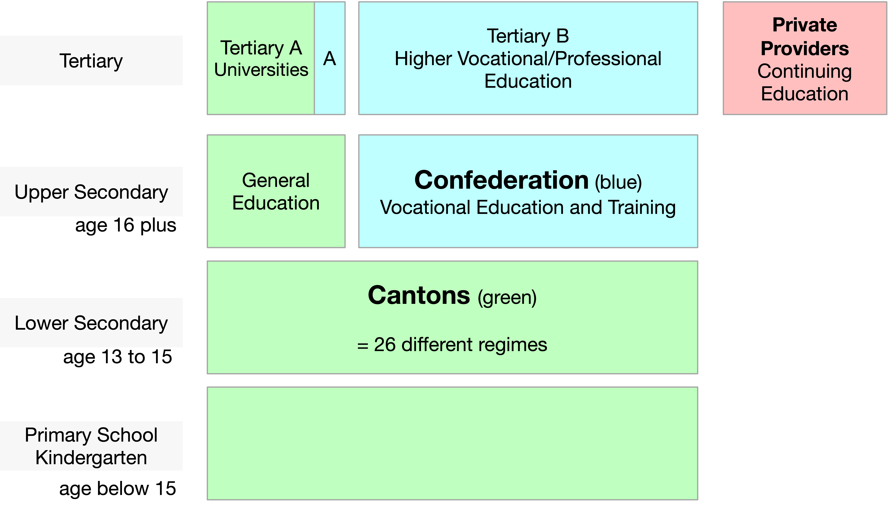
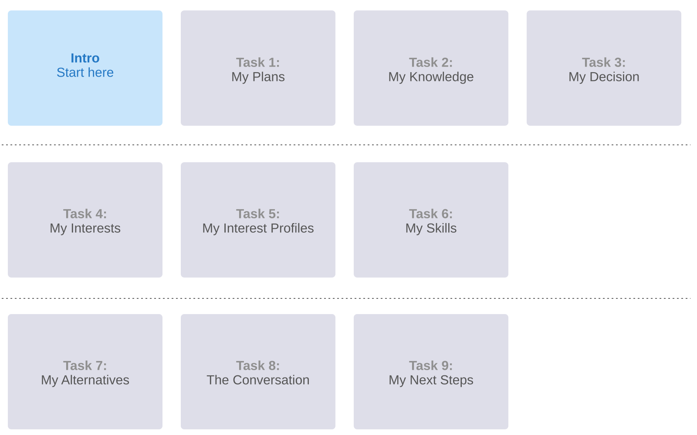
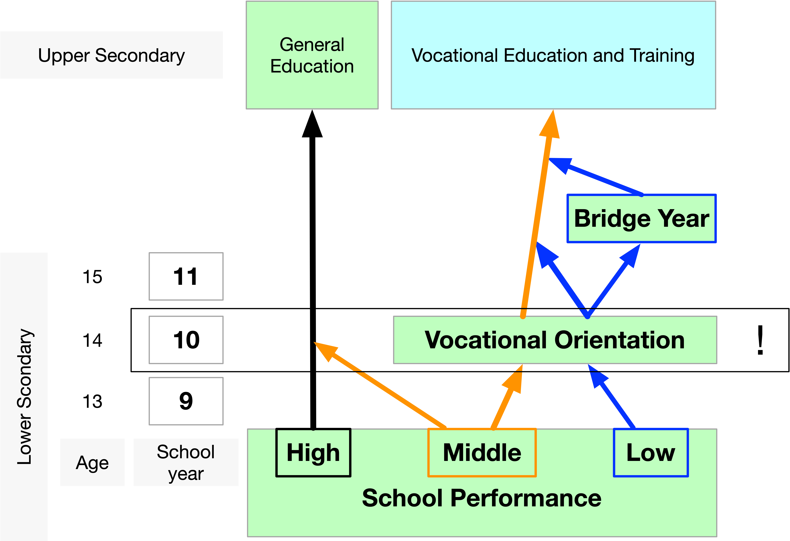

# 

**Balancing School-Based and Dual VET Pathways:  
Insights Into Student Perceptions**
    
Dr Christof Nägele  

::: {=html}

{width=95px}

University of Applied Sciences and Arts Northwestern Switzerland  
University of Basel
 
May 2026

:::

# Problem Statement

::: {=html}

C. Nägele, PH FHNW & Uni Basel

:::

In Switzerland, upper-secondary education includes …

- initial vocational education and training (iVET), the dual apprenticeship system, and 
- school-based pathways: upper-secondary commercial schools (WMS), specialised upper-secondary schools (FMS), and the Gymnasium.

**Many cantons promote iVET as the first choice.** 
Access to specialised upper-secondary schools is often restricted.

 This paper is about …

- how lower-secondary students aiming to enter upper-secondary schools perceive learning opportunities in general education (WMS, FMS) compared with iVET and 
- why they opt for general education and not iVET.

## Policy Background

Access to specialised upper-secondary schools needs to be regulated:

- avoid over-enrolment;
- grades should not be the sole criterion;
- ensure that students can explain why they want to attend a specialised upper-secondary school;
- for many students, iVET may be a better option (3- to 4-year apprenticeship).

## Education System

**Compulsory School - General Education - Cantonal Universities**

- 26 cantons – 26 different approaches to schooling
- Education policy is defined at the cantonal level.
- No national Ministry of Education.

**Vocational Education and Training**

- <a href="https://www.sbfi.admin.ch/de/verbundpartnerschaft">Tripartite partnership</a>
  - Confederation: strategic steering, legislation, quality assurance, and co-funding
  - Cantons: implementation and supervision (vocational schools and cantonal delivery)
  - World of work: defines occupational profiles, training plans and provides apprenticeship places

::: {.link}
Adopted and simplified from ["Konferenz der kantonalen Erziehungsdirektorinnen und -direktoren Bildungsgrafik"](https://www.edk.ch/de/bildungssystem/grafik) and 
[State Secretariat for Education, Research and Innovation SERI](https://www.sbfi.admin.ch/en)
:::

## VET - Academic Education
 

**Initial and Higher Vocational Education and Training (VET)**  → system-driven, labour market coordinated  
VET is central to ensuring a skilled workforce, facilitating labour market integration, and supporting lifelong learning in Switzerland.

**Key elements** 
- Labour market orientation 
- Dual system 
- Shared governance (partnership model; Confederation, Cantons, World of Work)  
Lifelong learning: initial VET → higher VET or → Bachelor → Master → Doctorate

**General Education and Higher Academic Education**  → institution-driven, research-oriented  
Institutional autonomy, strong research orientation, coordinated governance.  

**Key elements** 
- Academic orientation 
- Research-based teaching 
- Shared governance 
	(Universities / ETH, Cantons, Confederation)  
Lifelong learning: Bachelor → Master → Doctorate

::: {.link}
[State Secretariat for Education, Research and Innovation](https://www.sbfi.admin.ch/en) 
[The Swiss Conference of Cantonal Ministers of Education](https://www.edk.ch/en)
:::

## Measures Implemented by the Canton

All candidates complete an online self-assessment.

- Explain why they want to attend a specialised upper-secondary school.
- Reflect on pathways to higher education through VET.
- Justify why they prefer a specialised upper-secondary school over VET.

The online self-assessment is non-selective. Participants receive a completion certificate, which must be submitted with the school application.

# Methods: Design

## Methods: Sample 

<table class="sample-table">
  <thead>
    <tr>
      <th>Academic Year</th>
      <th>N</th>
      <th>Female %</th>
      <th>Male %</th>
      <th>Diverse %</th>
    </tr>
  </thead>
  <tbody>
    <tr><td>2018/2019</td><td>621</td><td>61.2%</td><td>38.8%</td><td>0.0%</td></tr>
    <tr><td>2019/2020</td><td>683</td><td>56.4%</td><td>43.6%</td><td>0.0%</td></tr>
    <tr><td>2020/2021</td><td>754</td><td>58.5%</td><td>41.0%</td><td>0.5%</td></tr>
    <tr><td>2021/2022</td><td>794</td><td>57.4%</td><td>41.8%</td><td>0.8%</td></tr>
    <tr><td>2022/2023</td><td>823</td><td>54.4%</td><td>44.8%</td><td>0.7%</td></tr>
    <tr><td>2023/2024</td><td>774</td><td>52.1%</td><td>47.4%</td><td>0.5%</td></tr>
    <tr><td>2024/2025</td><td>898</td><td>54.5%</td><td>45.1%</td><td>0.4%</td></tr>
    <tr><td>2025/2026</td><td>770</td><td>56.1%</td><td>43.4%</td><td>0.5%</td></tr>
    <tr style="background: linear-gradient(180deg, #253b55 0%, #1a2a3d 100%); color: #fff; font-weight: 700;">
      <td style="color: #fff;">Total</td>
      <td style="color: #fff;">6'117</td>
      <td style="color: #fff;">56.1%</td>
      <td style="color: #fff;">43.4%</td>
      <td style="color: #fff;">0.4%</td>
    </tr>
  </tbody>
</table>

   
Gender distribution in lower secondary education in Basel-Landschaft can be assumed to be broadly balanced across the analysed years, fluctuating only marginally around 50%.

# Results 

We used thematic analysis to identify patterns of meaning across participants’ responses.

**General education**. I imagine studying at a specialised upper-secondary school is easier than at a lower secondary school, because you have more time to plan everything yourself. The learning is also more tailored to the individual, as you can choose which compulsory-option subjects to take, so it’s certainly more enjoyable. You’ll probably spend more time learning on a computer and might even have your teaching materials and assignments online. There’ll likely be more group work and discussion too. It might also be easier to work with people who share the same interests.

**iVET**. In initial vocational education and training, learning on the job is quite different, because you learn by doing, gain experience and have the chance to try things out. At school, you’ll probably just learn the theory, which you can then put into practice at work.

:::{.source}
Braun, V., & Clarke, V. (2006). Using thematic analysis in psychology. Qualitative Research in Psychology, 3(2), 77–101. https://doi.org/10.1191/1478088706qp063oa
:::

# Results: Coding

In total, 79'327 coded segments were derived from responses by 6'117 participants to two questions on learning and development in general education at upper-secondary level (aged 16+).

This corresponds to a mean of 6.48 coded segments per person and question (12.97 per person across both questions).

Multiple codings within a single response were allowed.

At the time of response, participants were enrolled in lower secondary school (aged 14-15).

# Results Thematic Areas

A.  Learning Formats and Conceptions of Knowledge
B.  Future and Educational Orientation 
C.  Social Roles and Relationships 
D.  Competence and Identity 
E.  Evaluations and Attributions 

# Results: Thematic Areas Numbers

<table class="results-table">
  <thead>
    <tr>
      <th>Dimension</th>
      <th>Code</th>
      <th>GE Sum</th>
      <th>iVET Sum</th>
      <th>Present</th>
      <th>Sum GE + iVET</th>
    </tr>
  </thead>
  <tbody>
    <tr class="section-row">
      <th colspan="2">A. Learning Formats and Conceptions of Knowledge</th>
      <td>15168</td>
      <td>14207</td>
      <td>20295</td>
      <td>29375</td>
    </tr>
    <tr>
      <td>Practice ↔ Theory</td><td>A1</td><td>4379</td><td>3454</td><td>5266</td><td>7833</td>
    </tr>
    <tr>
      <td>World of Work ↔ School</td><td>A2</td><td>4225</td><td>4382</td><td>5330</td><td>8607</td>
    </tr>
    <tr>
      <td>Concreteness ↔ Abstraction</td><td>A3</td><td>1596</td><td>2006</td><td>2867</td><td>3602</td>
    </tr>
    <tr>
      <td>Independence ↔ Guidance</td><td>A4</td><td>1051</td><td>776</td><td>1642</td><td>1827</td>
    </tr>
    <tr>
      <td>Forms of Achievement</td><td>A5</td><td>3917</td><td>3589</td><td>5190</td><td>7506</td>
    </tr>

    <tr class="section-row">
      <th colspan="2">B. Future and Educational Orientation</th>
      <td>6942</td>
      <td>14030</td>
      <td>17419</td>
      <td>20972</td>
    </tr>
    <tr>
      <td>Vocational Preparation ↔ Educational Orientation</td><td>B1</td><td>1862</td><td>2968</td><td>3543</td><td>4830</td>
    </tr>
    <tr>
      <td>Productivity ↔ Preparation</td><td>B2</td><td>3610</td><td>2745</td><td>4726</td><td>6355</td>
    </tr>
    <tr>
      <td>Openness ↔ Specialisation</td><td>B3</td><td>263</td><td>2741</td><td>2826</td><td>3004</td>
    </tr>
    <tr>
      <td>Time Perspective</td><td>B4</td><td>913</td><td>1355</td><td>2032</td><td>2268</td>
    </tr>
    <tr>
      <td>Conceptions of Success</td><td>B5</td><td>294</td><td>4221</td><td>4292</td><td>4515</td>
    </tr>

    <tr class="section-row">
      <th colspan="2">C. Social Roles and Relationships</th>
      <td>6057</td>
      <td>2636</td>
      <td>7200</td>
      <td>8693</td>
    </tr>
    <tr>
      <td>Adulthood ↔ Student Role</td><td>C1</td><td>3094</td><td>2164</td><td>4029</td><td>5258</td>
    </tr>
    <tr>
      <td>Practical Experts ↔ Teachers</td><td>C2</td><td>893</td><td>113</td><td>966</td><td>1006</td>
    </tr>
    <tr>
      <td>Social Integration</td><td>C3</td><td>2070</td><td>359</td><td>2205</td><td>2429</td>
    </tr>

    <tr class="section-row">
      <th colspan="2">D. Competence and Identity</th>
      <td>5067</td>
      <td>3772</td>
      <td>8270</td>
      <td>8839</td>
    </tr>
    <tr>
      <td>Physicality ↔ Intellectuality</td><td>D1</td><td>460</td><td>67</td><td>521</td><td>527</td>
    </tr>
    <tr>
      <td>Work Ethic and Achievement Orientation</td><td>D2</td><td>4348</td><td>463</td><td>4436</td><td>4811</td>
    </tr>
    <tr>
      <td>Identity Constructions</td><td>D3</td><td>259</td><td>3242</td><td>3313</td><td>3501</td>
    </tr>

    <tr class="section-row">
      <th colspan="2">E. Evaluations and Attributions</th>
      <td>5257</td>
      <td>6191</td>
      <td>10592</td>
      <td>11448</td>
    </tr>
    <tr>
      <td>Educational Status</td><td>E1</td><td>675</td><td>30</td><td>696</td><td>705</td>
    </tr>
    <tr>
      <td>Practical Morality and Authenticity</td><td>E2</td><td>259</td><td>670</td><td>840</td><td>929</td>
    </tr>
    <tr>
      <td>Promises for the Future</td><td>E3</td><td>263</td><td>1238</td><td>1428</td><td>1501</td>
    </tr>
    <tr>
      <td>Social Recognition</td><td>E4</td><td>406</td><td>3236</td><td>3387</td><td>3642</td>
    </tr>
    <tr>
      <td>Devaluation of the Other Educational Pathway</td><td>E5</td><td>196</td><td>101</td><td>293</td><td>297</td>
    </tr>
    <tr>
      <td>Emotional Attributions</td><td>E6</td><td>975</td><td>688</td><td>1383</td><td>1663</td>
    </tr>
    <tr>
      <td>Symbolic Boundary-Making</td><td>E7</td><td>2483</td><td>228</td><td>2565</td><td>2711</td>
    </tr>
  </tbody>
</table>

# Results 2

Typical statements

## A. Learning Formats and Conceptions of Knowledge

- *GE* is associated more with theory, school-based learning, abstraction, guidance, and grades   
- *iVET* is associated more with practical application, the world of work, concreteness, independence, and performance in real work situations

<table class="examples-table">
  <thead>
    <tr>
      <th>Dimension</th>
      <th>Code</th>
      <th>Pole</th>
      <th>Example</th>
    </tr>
  </thead>
  <tbody>
    <tr><td class="dimension-cell" rowspan="2">Practice ↔ Theory</td><td class="code-cell" rowspan="2">A1</td><td class="pole-cell">GE</td><td class="example-cell">In school you mainly learn theories and concepts.</td></tr>
    <tr><td class="pole-cell">iVET</td><td class="example-cell">In vocational education and training you actually apply things in practice every day.</td></tr>
    <tr class="spacer-row"><td colspan="4"></td></tr>
    <tr><td class="dimension-cell" rowspan="2">World of Work ↔ School</td><td class="code-cell" rowspan="2">A2</td><td class="pole-cell">GE</td><td class="example-cell">General education still feels very much like school.</td></tr>
    <tr><td class="pole-cell">iVET</td><td class="example-cell">Apprentices are already part of the real working world.</td></tr>
    <tr class="spacer-row"><td colspan="4"></td></tr>
    <tr><td class="dimension-cell" rowspan="2">Concreteness ↔ Abstraction</td><td class="code-cell" rowspan="2">A3</td><td class="pole-cell">GE</td><td class="example-cell">A lot of the content is abstract and not directly applicable.</td></tr>
    <tr><td class="pole-cell">iVET</td><td class="example-cell">You immediately see what your work is useful for.</td></tr>
    <tr class="spacer-row"><td colspan="4"></td></tr>
    <tr><td class="dimension-cell" rowspan="2">Independence ↔ Guidance</td><td class="code-cell" rowspan="2">A4</td><td class="pole-cell">GE</td><td class="example-cell">At school you are more guided step by step.</td></tr>
    <tr><td class="pole-cell">iVET</td><td class="example-cell">In the company you quickly have to work independently.</td></tr>
    <tr class="spacer-row"><td colspan="4"></td></tr>
    <tr><td class="dimension-cell" rowspan="2">Forms of Achievement</td><td class="code-cell" rowspan="2">A5</td><td class="pole-cell">GE</td><td class="example-cell">Success is mainly measured through grades and exams.</td></tr>
    <tr><td class="pole-cell">iVET</td><td class="example-cell">What counts is whether you can actually do the job well.</td></tr>
  </tbody>
</table>

## B. Future and Educational Orientation

- *GE* is associated with broad academic preparation, openness, delayed labour market entry, and academic achievement 
- *iVET* is associated with vocational preparation, productive contribution, early specialisation, earlier entry into work, and professional independence

<table class="examples-table">
  <thead>
    <tr>
      <th>Dimension</th>
      <th>Code</th>
      <th>Pole</th>
      <th>Example</th>
    </tr>
  </thead>
  <tbody>
    <tr><td class="dimension-cell" rowspan="2">Vocational Preparation ↔ Educational Orientation</td><td class="code-cell" rowspan="2">B1</td><td class="pole-cell">GE</td><td class="example-cell">General education prepares broadly for university.</td></tr>
    <tr><td class="pole-cell">iVET</td><td class="example-cell">Vocational education prepares you for a profession.</td></tr>
    <tr class="spacer-row"><td colspan="4"></td></tr>
    <tr><td class="dimension-cell" rowspan="2">Productivity ↔ Preparation</td><td class="code-cell" rowspan="2">B2</td><td class="pole-cell">GE</td><td class="example-cell">School is mainly preparation for later.</td></tr>
    <tr><td class="pole-cell">iVET</td><td class="example-cell">Apprentices already contribute and earn money.</td></tr>
    <tr class="spacer-row"><td colspan="4"></td></tr>
    <tr><td class="dimension-cell" rowspan="2">Openness ↔ Specialisation</td><td class="code-cell" rowspan="2">B3</td><td class="pole-cell">GE</td><td class="example-cell">General education keeps options open.</td></tr>
    <tr><td class="pole-cell">iVET</td><td class="example-cell">Vocational education specialises early.</td></tr>
    <tr class="spacer-row"><td colspan="4"></td></tr>
    <tr><td class="dimension-cell" rowspan="2">Time Perspective</td><td class="code-cell" rowspan="2">B4</td><td class="pole-cell">GE</td><td class="example-cell">Students stay longer in education before work.</td></tr>
    <tr><td class="pole-cell">iVET</td><td class="example-cell">Apprentices enter the labour market earlier.</td></tr>
    <tr class="spacer-row"><td colspan="4"></td></tr>
    <tr><td class="dimension-cell" rowspan="2">Conceptions of Success</td><td class="code-cell" rowspan="2">B5</td><td class="pole-cell">GE</td><td class="example-cell">Academic achievement opens future opportunities.</td></tr>
    <tr><td class="pole-cell">iVET</td><td class="example-cell">Professional success and independence matter most.</td></tr>
  </tbody>
</table>

## C. Social Roles and Relationships

- *GE* is associated with a student role, theoretical teaching, and peer-based school settings 
- *iVET* is associated with adulthood, learning from experienced practitioners, and integration into adult work teams

<table class="examples-table">
  <thead>
    <tr>
      <th>Dimension</th>
      <th>Code</th>
      <th>Pole</th>
      <th>Example</th>
    </tr>
  </thead>
  <tbody>
    <tr><td class="dimension-cell" rowspan="2">Adulthood ↔ Student Role</td><td class="code-cell" rowspan="2">C1</td><td class="pole-cell">GE</td><td class="example-cell">General education students remain in a pupil role.</td></tr>
    <tr><td class="pole-cell">iVET</td><td class="example-cell">Apprentices are treated more like adults.</td></tr>
    <tr class="spacer-row"><td colspan="4"></td></tr>
    <tr><td class="dimension-cell" rowspan="2">Practical Experts ↔ Teachers</td><td class="code-cell" rowspan="2">C2</td><td class="pole-cell">GE</td><td class="example-cell">Teachers mainly convey theoretical knowledge.</td></tr>
    <tr><td class="pole-cell">iVET</td><td class="example-cell">Vocational trainers teach from experience.</td></tr>
    <tr class="spacer-row"><td colspan="4"></td></tr>
    <tr><td class="dimension-cell" rowspan="2">Social Integration</td><td class="code-cell" rowspan="2">C3</td><td class="pole-cell">GE</td><td class="example-cell">School means being with peers in a class.</td></tr>
    <tr><td class="pole-cell">iVET</td><td class="example-cell">Apprentices work with adults in teams.</td></tr>
  </tbody>
</table>

## D. Competence and Identity

- *GE* is associated with intellectual work, academic discipline, and achievement-based student identities 
- *iVET* is associated with practical activity, reliability in work contexts, and the development of occupational identities

<table class="examples-table">
  <thead>
    <tr>
      <th>Dimension</th>
      <th>Code</th>
      <th>Pole</th>
      <th>Example</th>
    </tr>
  </thead>
  <tbody>
    <tr><td class="dimension-cell" rowspan="2">Physicality ↔ Intellectuality</td><td class="code-cell" rowspan="2">D1</td><td class="pole-cell">GE</td><td class="example-cell">General education is mainly intellectual work.</td></tr>
    <tr><td class="pole-cell">iVET</td><td class="example-cell">Vocational education adds practical activity.</td></tr>
    <tr class="spacer-row"><td colspan="4"></td></tr>
    <tr><td class="dimension-cell" rowspan="2">Work Ethic and Achievement Orientation</td><td class="code-cell" rowspan="2">D2</td><td class="pole-cell">GE</td><td class="example-cell">School requires diligence and discipline.</td></tr>
    <tr><td class="pole-cell">iVET</td><td class="example-cell">Vocational education emphasises reliability.</td></tr>
    <tr class="spacer-row"><td colspan="4"></td></tr>
    <tr><td class="dimension-cell" rowspan="2">Identity Constructions</td><td class="code-cell" rowspan="2">D3</td><td class="pole-cell">GE</td><td class="example-cell">Students identify with academic achievement.</td></tr>
    <tr><td class="pole-cell">iVET</td><td class="example-cell">Apprentices build occupational identity.</td></tr>
  </tbody>
</table>

## E. Evaluations and Attributions

- *GE* is associated with higher prestige, academic futures, educational recognition, and school-based identities 
- *iVET* is associated with authenticity, early independence, practical recognition, and adult-like occupational identities

<table class="examples-table">
  <thead>
    <tr>
      <th>Dimension</th>
      <th>Code</th>
      <th>Pole</th>
      <th>Example</th>
    </tr>
  </thead>
  <tbody>
    <tr><td class="dimension-cell" rowspan="2">Educational Status</td><td class="code-cell" rowspan="2">E1</td><td class="pole-cell">GE</td><td class="example-cell">General education school has higher social prestige.</td></tr>
    <tr><td class="pole-cell">iVET</td><td class="example-cell">Vocational education has lower status.</td></tr>
    <tr class="spacer-row"><td colspan="4"></td></tr>
    <tr><td class="dimension-cell" rowspan="2">Practical Morality and Authenticity</td><td class="code-cell" rowspan="2">E2</td><td class="pole-cell">GE</td><td class="example-cell">School can feel theoretical and distant.</td></tr>
    <tr><td class="pole-cell">iVET</td><td class="example-cell">Vocational education feels closer to real life.</td></tr>
    <tr class="spacer-row"><td colspan="4"></td></tr>
    <tr><td class="dimension-cell" rowspan="2">Promises for the Future</td><td class="code-cell" rowspan="2">E3</td><td class="pole-cell">GE</td><td class="example-cell">General education points to university and careers.</td></tr>
    <tr><td class="pole-cell">iVET</td><td class="example-cell">Vocational education promises early independence.</td></tr>
    <tr class="spacer-row"><td colspan="4"></td></tr>
    <tr><td class="dimension-cell" rowspan="2">Social Recognition</td><td class="code-cell" rowspan="2">E4</td><td class="pole-cell">GE</td><td class="example-cell">Educational success gets strong recognition.</td></tr>
    <tr><td class="pole-cell">iVET</td><td class="example-cell">Vocational competence gets recognition through performance.</td></tr>
    <tr class="spacer-row"><td colspan="4"></td></tr>
    <tr><td class="dimension-cell" rowspan="2">Devaluation of the Other Educational Pathway</td><td class="code-cell" rowspan="2">E5</td><td class="pole-cell">GE</td><td class="example-cell">Vocational education is stereotyped as less academic.</td></tr>
    <tr><td class="pole-cell">iVET</td><td class="example-cell">General education students are mocked for classrooms.</td></tr>
    <tr class="spacer-row"><td colspan="4"></td></tr>
    <tr><td class="dimension-cell" rowspan="2">Emotional Attributions</td><td class="code-cell" rowspan="2">E6</td><td class="pole-cell">GE</td><td class="example-cell">General education is stressful but stimulating.</td></tr>
    <tr><td class="pole-cell">iVET</td><td class="example-cell">Vocational education is meaningful but demanding.</td></tr>
    <tr class="spacer-row"><td colspan="4"></td></tr>
    <tr><td class="dimension-cell" rowspan="2">Symbolic Boundary-Making</td><td class="code-cell" rowspan="2">E7</td><td class="pole-cell">GE</td><td class="example-cell">General education aligns with school identities.</td></tr>
    <tr><td class="pole-cell">iVET</td><td class="example-cell">Vocational education aligns with practical, adult-like identities.</td></tr>
  </tbody>
</table>

# Results 3: Why general education is preferred, compared to iVET

**A. Learning Formats and Conceptions of Knowledge**

Preferred for theoretical and intellectual learning, structured school contexts, and achievement measured through grades and examinations.

**B. Future and Educational Orientation**

Preferred for open and flexible pathways, long-term preparation, and identities oriented towards academic success and future opportunities.

**C. Social Roles and Relationships**

Preferred because remaining in the student role is socially appropriate, while teachers and peer-based school environments are valued.

**D. Competence and Identity**

Preferred where intellectual work, diligence, and cognitive performance are valued, supporting academic self-identities.

**E. Evaluations and Attributions**

Preferred due to higher prestige, stronger recognition, and broader futures, while iVET may be viewed as narrower and less intellectually demanding.

# Over the Years 

<table class="over-years-table">
  <thead>
    <tr>
      <th>Academic Year</th>
      <th>A. Learning Formats and Conceptions of Knowledge</th>
      <th>B. Future and Educational Orientation</th>
      <th>C. Social Roles and Relationships</th>
      <th>D. Competence and Identity</th>
      <th>E. Evaluations and Attributions</th>
    </tr>
  </thead>
  <tbody>
    <tr><td>2018/2019</td><td>23.2</td><td>21.4</td><td>16.5</td><td>20.5</td><td>18.4</td></tr>
    <tr><td>2019/2020</td><td>23.1</td><td>21.5</td><td>16.9</td><td>20.2</td><td>18.3</td></tr>
    <tr><td>2020/2021</td><td>23.1</td><td>21.7</td><td>16.6</td><td>20.5</td><td>18.0</td></tr>
    <tr><td>2021/2022</td><td>22.9</td><td>21.0</td><td>17.1</td><td>19.9</td><td>19.2</td></tr>
    <tr><td>2022/2023</td><td>22.8</td><td>21.2</td><td>17.2</td><td>20.0</td><td>18.8</td></tr>
    <tr><td>2023/2024</td><td>23.0</td><td>21.0</td><td>17.0</td><td>20.1</td><td>18.8</td></tr>
    <tr><td>2024/2025</td><td>22.8</td><td>20.9</td><td>17.5</td><td>20.0</td><td>18.8</td></tr>
    <tr><td>2025/2026</td><td>22.2</td><td>20.4</td><td>17.8</td><td>20.5</td><td>19.0</td></tr>
  </tbody>
</table>

 

χ2(28) = 7.73, p = .9999

## Conclusions: Deep Refelction Not in Demand
  

Main Drivers:

- End of compulsory schooling (compulsory education ends at 16, nobody can fail).
- Teachers and Schools
- Switzerland has establish a system that efficently pushes youth into upper secondary education in a process that takes 6 months. 
  

Predominant Paradigm:  Fit, one-time matching

# Conclusions the Labour Market 

::: {.labour-market-slide}
- There is a cleary policy to make iVET the first choice for all. 

  - **Canton Basel-Landschaft (rural) approx.  54%**
  - Canton Basel-Stadt (city) 35 - 40% 
  - Students in VET in Switzerland  65 - 70%
 

- Nevertheless
  - Students that have the choice GE or iVET prefer iVET

- No changes during the last 8 years
  - despite different measuers of the canton  

- It might be: The labour market in that specific region does not (only) ask for "Berufe", but offers jobs that are better accesible through general education and not iVET. 
:::

# Storage

## A. Learning Formats and Conceptions of Knowledge

<table class="why-table">
  <thead>
    <tr>
      <th>Dimension</th>
      <th>Code</th>
      <th>Why general education is preferred</th>
    </tr>
  </thead>
  <tbody>
    <tr class="section-row"><th colspan="3">A. Learning Formats and Conceptions of Knowledge</th></tr>
    <tr><td>Practice ↔ Theory</td><td>A1</td><td>General education is associated with theoretical, intellectual, and knowledge-oriented learning.</td></tr>
    <tr><td>World of Work ↔ School</td><td>A2</td><td>Students prefer remaining in a school-based environment rather than entering the workplace early.</td></tr>
    <tr><td>Concreteness ↔ Abstraction</td><td>A3</td><td>Abstract thinking and academic knowledge are valued positively.</td></tr>
    <tr><td>Independence ↔ Guidance</td><td>A4</td><td>Some students appreciate the more structured and guided learning environment of school.</td></tr>
    <tr><td>Forms of Achievement</td><td>A5</td><td>Academic achievement, grades, and examinations are recognised as meaningful indicators of success.</td></tr>
  </tbody>
</table>

## B. Future and Educational Orientation

<table class="why-table">
  <thead>
    <tr>
      <th>Dimension</th>
      <th>Code</th>
      <th>Why general education is preferred</th>
    </tr>
  </thead>
  <tbody>
    <tr class="section-row"><th colspan="3">B. Future and Educational Orientation</th></tr>
    <tr><td>Vocational Preparation ↔ Educational Orientation</td><td>B1</td><td>General education is seen as keeping educational and career pathways open, especially university access.</td></tr>
    <tr><td>Productivity ↔ Preparation</td><td>B2</td><td>Education is understood as long-term preparation rather than immediate productivity.</td></tr>
    <tr><td>Openness ↔ Specialisation</td><td>B3</td><td>Students value postponing occupational specialisation and preserving flexibility.</td></tr>
    <tr><td>Time Perspective</td><td>B4</td><td>A longer educational trajectory is accepted or even desired.</td></tr>
    <tr><td>Conceptions of Success</td><td>B5</td><td>Success is associated with academic attainment, social mobility, and future opportunities.</td></tr>
  </tbody>
</table>

## C. Social Roles and Relationships

<table class="why-table">
  <thead>
    <tr>
      <th>Dimension</th>
      <th>Code</th>
      <th>Why general education is preferred</th>
    </tr>
  </thead>
  <tbody>
    <tr class="section-row"><th colspan="3">C. Social Roles and Relationships</th></tr>
    <tr><td>Adulthood ↔ Student Role</td><td>C1</td><td>Remaining in the student role may be perceived as socially desirable or developmentally appropriate.</td></tr>
    <tr><td>Practical Experts ↔ Teachers</td><td>C2</td><td>Teachers and academic expertise are valued as legitimate sources of knowledge.</td></tr>
    <tr><td>Social Integration</td><td>C3</td><td>Peer groups and school-based social environments are important.</td></tr>
  </tbody>
</table>

## D. Competence and Identity

<table class="why-table">
  <thead>
    <tr>
      <th>Dimension</th>
      <th>Code</th>
      <th>Why general education is preferred</th>
    </tr>
  </thead>
  <tbody>
    <tr class="section-row"><th colspan="3">D. Competence and Identity</th></tr>
    <tr><td>Physicality ↔ Intellectuality</td><td>D1</td><td>Intellectual work is often valued more highly than physical or manual labour.</td></tr>
    <tr><td>Work Ethic and Achievement Orientation</td><td>D2</td><td>Academic diligence and cognitive performance are central markers of competence.</td></tr>
    <tr><td>Identity Constructions</td><td>D3</td><td>Students construct identities around being “academic”, “intelligent”, or “good at school”.</td></tr>
  </tbody>
</table>

## E. Evaluations and Attributions

<table class="why-table">
  <thead>
    <tr>
      <th>Dimension</th>
      <th>Code</th>
      <th>Why general education is preferred</th>
    </tr>
  </thead>
  <tbody>
    <tr class="section-row"><th colspan="3">E. Evaluations and Attributions</th></tr>
    <tr><td>Educational Status</td><td>E1</td><td>General education is associated with higher social prestige and status.</td></tr>
    <tr><td>Practical Morality and Authenticity</td><td>E2</td><td>Vocational education may sometimes be perceived as too narrow or limiting despite being practical.</td></tr>
    <tr><td>Promises for the Future</td><td>E3</td><td>General education is linked to university studies, careers, and broader future possibilities.</td></tr>
    <tr><td>Social Recognition</td><td>E4</td><td>Academic pathways are perceived as more socially recognised.</td></tr>
    <tr><td>Devaluation of the Other Educational Pathway</td><td>E5</td><td>Vocational education may implicitly or explicitly be constructed as less prestigious or less intellectually demanding.</td></tr>
    <tr><td>Emotional Attributions</td><td>E6</td><td>General education may be associated with interest, curiosity, openness, and aspiration despite stress.</td></tr>
    <tr><td>Symbolic Boundary-Making</td><td>E7</td><td>Students position themselves symbolically as “academic”, “theoretical”, or “education-oriented” rather than “practical” or “manual”.</td></tr>
  </tbody>
</table>

